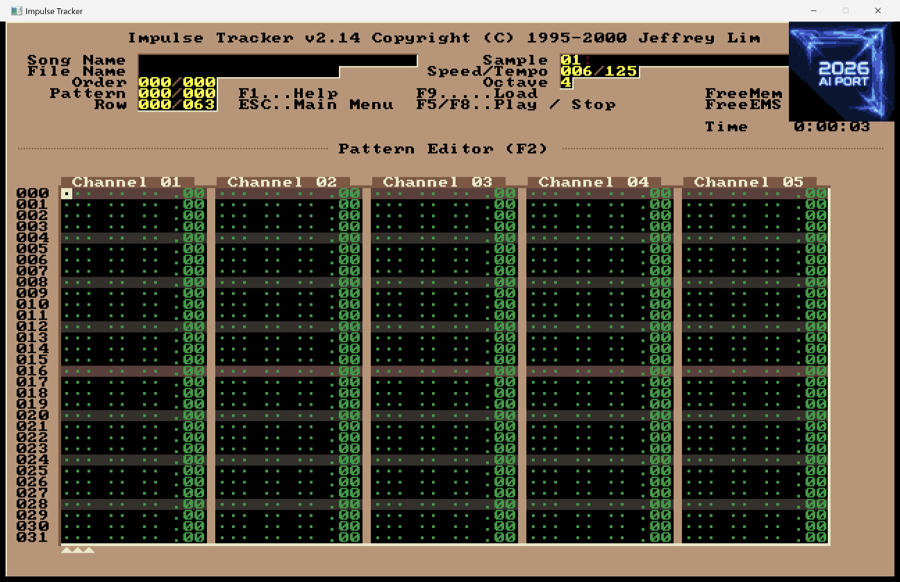

# ittrack — a native cross-platform port of Impulse Tracker

TL;DR AI-vibed 1:1 conversion of Jeffrey Lim's fantastic Impulse Tracker to modern operating systems. Originally written in pure (!) 486 x86 assembly code, this aims to be the first near-complete 1:1 translation of both the playback engine and the editor to C/SDL. The conversion was carried out fully with Anthropic's Claude models (Fable 5, Opus 4.8, Opus 5 and Opus 5.5). Everything I tested works - but bugs might still exist!

(The AI port banner disappears after 10 secs)

## Background
About 30 years ago I was quite a nerdy teenager. My parents had just bought a 486 DX computer with a terrible Sound Blaster Pro clone. A little while later a modem, BBS access and AOL followed. Somewhere I first downloaded the legendary [Scream Tracker 3](https://en.wikipedia.org/wiki/Scream_Tracker) (S3M) by the also legendary Future Crew. A short time later I learned about [Impulse Tracker](https://en.wikipedia.org/wiki/Impulse_Tracker) (IT) by Jeffrey Lim. I started jamming with it and wrote quite some songs, which I gladly never released :-) Impulse Tracker is a fantastic piece of software, and arguably one of the best trackers ever written. It sounds fantastic. Its usability is outstanding. And its resource usage was already low back in the day. One of the reasons was that it was brilliantly designed and really heavily optimized. It is written in pure x86 assembly code. That is one of the reasons it never got directly ported to modern operating systems. Since then, there have been repeated efforts to bring the "feel" of IT to the more modern world. One great and famous example is [Schism Tracker](https://schismtracker.org/), which combines an Impulse-Tracker-aligned interface with the [Modplug playback](https://openmpt.org/legacy_software) engine.

### 30 years later - we have AI
30 years later, we find ourselves in the middle of the AI revolution. The nerdy teenager has become an engineering manager who also obtained a PhD in computer science over a decade ago. The nerd in me still enjoys jamming sometimes, mostly in [Reaper](https://www.reaper.fm/) and [Renoise](https://www.renoise.com/). But deep in my heart I am still obsessed with Impulse Tracker. And yes, I hate Suno! :P

Once Fable 5 became available I couldn't resist and put it to an extreme test: Can an AI model of this class create a working 1:1 port of Impulse Tracker for modern operating systems? Quite shockingly, the answer is yes. I threw Fable 5 (and in parts Opus 4.8) at it, using [spec-kit](https://github.com/github/spec-kit) to steer its progress. Of course it was not a one-shot miracle: we went through quite some testing iterations, for example to hunt down flickering in the editor screen. 

After burning quite a bunch of tokens, I am happy to present you an AI port of Impulse Tracker! By design, this port does not adopt new features. We don't fix glitches or bugs of Impulse Tracker. If you run this code, you get what IT 2.17 did. Not more and not less!

## Now we let the AI explain the rest :P

ittrack is a 1:1 C port of Jeffrey Lim's Impulse Tracker for Windows,
macOS and Linux. It has two parts:

- **The playback engine:** the complete IT 2.17 engine, transliterated
  instruction by instruction from the released x86 assembly source
  (https://github.com/jthlim/impulse-tracker, the author's own
  publication). This is **not** a generic module player wired to .IT
  files; the playing routines are the original ones.
- **The editor:** the original screen layouts, font, palette, key tables,
  dialogs and behaviours, taken from the same source rather than
  approximated. That includes the context-sensitive F1 help, whose pages
  are generated from IT's own help data.

The main way to use it is the **pixel window**. It shows the same
640x400 picture IT's VGA 80x50 text mode drew, with the real font,
palette and bevel glyphs, and works with keyboard and mouse. On Windows
it is a native Win32 window; on macOS and Linux it is an SDL2 window.
A terminal fallback exists for headless machines (see below), but it is
not the focus.

### How it was built

The port was written by Anthropic's Claude models: **Fable 5** did most
of the engine and editor, with **Opus 4.8**, **Opus 5** and **Opus 5.5**
taking over later features and the long tail of fidelity fixes. The work
was steered with [spec-kit](https://github.com/github/spec-kit): one
spec, plan and task list per feature, in `specs/`. Every change is
checked against the original assembly, not against memory of how IT
behaved.

It has since been tested hard against the real IT 2.14. Many of the
recent fixes come from side-by-side comparisons by **Esa Juhani Ruoho
([@esaruoho](https://github.com/esaruoho))**, who reports differences as
GitHub issues and has contributed pull requests. The open issues are
the live list of known gaps.

Three safety nets keep the port honest:

- **A scripted selftest** in the editor (18 blocks covering screens, key
  bindings, dialogs, load/save and the mixer's output formats).
- **A determinism gate:** four test modules are rendered and must stay
  bit-identical, including after a save/load round trip in every format.
- **CI builds** on Windows, Linux and macOS for every push to `master`
  and every pull request, plus a rolling release.

### What maps to what

| Port file        | Original source                | What it is |
|------------------|--------------------------------|------------|
| `src/it_music.c` | `IT_MUSIC.ASM`                 | sequencer core: `Update`, `UpdateData`, `UpdateNoteData`, `UpdateInstruments`, `UpdateSamples`, `UpdateEnvelope`, `UpdateVibrato`, NNA channel allocator, pitch slides (FPU paths), `Music_*` play control |
| `src/it_effects.c` | `IT_M_EFF.INC`               | all effect handlers A–Z, volume-column effects, S-commands, with the original dispatch tables |
| `src/it_tables.c` | `IT_MUSIC.ASM` data            | pitch table, waveform tables, slide LUTs, transcribed verbatim *including the original tables' typos* (they are part of the sound) |
| `src/it_driver.c` | `WAVDRV.ASM` + `MIXWAV.INC` + `WAV.MIX` | the high-quality software mixer (= ITWAV.DRV): 256 channels, cubic spline interpolation, the IT resonant filter, volume ramping, click removal, error-feedback dither; plus the Shift-F5 extensions (see Audio) |
| `src/it_load.c`  | (the `IT_DISK.ASM` load path, against `ITTECH.TXT`) | .IT loader; keeps patterns in the packed on-disk format because the engine decodes packed rows directly, IT 2.14/2.15 sample decompression, MIDI macros |
| `src/it_structs.h` | `InternalDocumentation/CHANNEL.TXT` | host/slave channel layouts, byte for byte, enforced with `_Static_assert` |
| `src/it_save.c`  | `IT_DISK.ASM`                  | .IT writer with the IT 2.14/2.15 sample compressor, and the `D_SaveS3M` S3M exporter with its lossy-conversion quirks |
| `src/it_import.c` | IT's own importers             | whole-module S3M/XM/MOD/MTM/669 conversion, quirks included |
| `src/it_ris.c`   | `D_GetSampleInfo` + `Load*SamplesInModule` | sample/instrument identification and the library rippers (WAV, IFF 8SVX/16SV, TX16W, .ITS/.ITI/.XI, samples and instruments out of other modules, any other file as raw data) |
| `src/it_editor.c` | `IT_F.ASM`, `IT_PE.ASM`, `IT_OBJ1.ASM`, `IT_I.ASM`, `IT_DISK.ASM`, `IT_H.ASM`, `IT_FOUR.ASM` | the editor: IT's object model, every screen's layout data, the key tables, help, the Fourier spectrum analyser |
| `src/it_help.inc` | `IT_H.ASM` data               | the F1 help pages and word dictionary, generated by `tools/gen_help.py` |
| `src/it_screen.c`, `src/it_vgadata.c` | `IT_S.ASM` | the 80x50 cell display with the byte-exact VGA font, palette and glyph data |
| `src/it_screen_win32.c`, `src/it_screen_sdl.c` | (port-side) | the pixel window: native Win32 on Windows, SDL2 on macOS/Linux |
| `src/it_pattern.c` | (port-side)                   | unpacked pattern grid for editing; re-packs to the on-disk format the engine plays, verified byte-identical |
| `src/main.c`     | (port-side)                    | `itplay` command-line player / WAV renderer |

The build configuration mirrors the 2.17 release (`SWITCH.INC`):
`USEFPUCODE=1` (FPU slide math; the 2.14 lookup-table variants are also
ported under `USEFPUCODE=0`), and the mixer uses the `WAVSWITC.INC`
settings (`VOLUMERAMP=1`, `CUBICINTERPOLATION=1`, `DITHEROUTPUT=1`,
`RAMPSPEED=8`, `RAMPCOMPENSATE=255`).

## Getting it

### Prebuilt binaries

The [releases page](../../releases) has self-contained builds for each
platform: the rolling `continuous` prerelease (refreshed on every push
to `master`) and pinned tagged versions.

| Platform | Artifact | Notes |
|----------|----------|-------|
| Windows | `…-windows-x64-setup.exe`, `…-windows-x64.zip` | installer or portable ZIP |
| macOS | `ittrack-…-macos-<arch>.dmg` | `ited.app` with SDL2 inside, plus the `itplay` CLI |
| Linux | `ited-…-x86_64.AppImage`, `itplay-…-linux-x86_64` | editor AppImage (SDL2 bundled) + bare player |

The macOS DMG is not code-signed or notarised, so Gatekeeper quarantines
it on first launch: right-click `ited.app` → **Open** (or run
`xattr -dr com.apple.quarantine ited.app`) once, and it runs normally
from then on.

### Building from source

Any C11 compiler. Audio goes through miniaudio (vendored, single
header): WASAPI on Windows, Core Audio on macOS, ALSA/PulseAudio on
Linux. The pixel window needs **SDL2 on macOS and Linux**; Windows needs
nothing extra.

**macOS, one step:** `./build_mac.sh` configures and builds the editor
with SDL2 and launches it (contributed by @esaruoho). Install SDL2 first
with `brew install sdl2`.

**CMake (all platforms):**

    brew install sdl2            # macOS
    sudo apt install libsdl2-dev # Debian/Ubuntu (or SDL2-devel etc.)
    cmake -B build
    cmake --build build --config Release

This builds `ited` (the editor), `itplay` (player / WAV renderer) and
`test_pattern` (the determinism gate). On Windows run it from an
**x64 Native Tools** (vcvars64) prompt; the VS Build Tools ship `cmake`
and `ninja` there even when neither is on the general PATH.

**No pixel window on macOS/Linux?** Then SDL2 wasn't compiled in, and
`ited` falls back to the terminal. CMake detects SDL2 at *configure*
time and caches the result, so after installing SDL2 wipe the build
directory (`rm -rf build`) and configure again. The configure output
says `ited: SDL2 not found; building editor with the terminal backend
only` while it's missing. On Apple Silicon, point CMake at Homebrew
with `cmake -B build -DCMAKE_PREFIX_PATH="$(brew --prefix sdl2)"`. Also
make sure `ITED_TERM` is unset; any value forces the terminal.

**GNU Make (Linux, macOS, MSYS2):** `make` builds all three targets with
SDL2 auto-detected via `pkg-config`/`sdl2-config`; `make test` runs the
determinism gate; `make help` lists the options. CMake remains the
canonical build and the only one for MSVC.

**Direct compiler invocation, Windows (MSVC, vcvars64 prompt):**

    cl /std:c11 /O2 /W3 /D_CRT_SECURE_NO_WARNINGS /Fe:ited.exe ^
       src\it_music.c src\it_effects.c src\it_tables.c src\it_driver.c ^
       src\it_load.c src\it_pattern.c src\it_save.c src\it_import.c ^
       src\it_ris.c src\it_screen.c src\it_screen_win32.c ^
       src\it_cornerart.c src\it_vgadata.c src\it_editor.c ^
       user32.lib gdi32.lib

    cl /std:c11 /O2 /W3 /D_CRT_SECURE_NO_WARNINGS /Fe:itplay.exe ^
       src\it_music.c src\it_effects.c src\it_tables.c src\it_driver.c ^
       src\it_load.c src\it_pattern.c src\it_save.c src\main.c

`test_pattern` is the engine sources plus `tests/test_pattern.c`.
Python is only needed to regenerate checked-in generated files (test
fixtures, `src/it_vgadata.c`, `src/it_help.inc`); building needs none of
it.

**The VGA ROM font** (IBM's 8x8 CP437 character ROM) is not committed,
since its bytes may be copyrighted. `src/it_vgadata.c`, which bakes it
into C tables, *is* committed, so a normal build needs nothing extra.
Only regenerating it (`make vgadata`) fetches the font via `make font`
from [spacerace/romfont](https://github.com/spacerace/romfont/tree/master/font-bin),
pinned and SHA-256-checked.

### Verifying a build

    ITED_SELFTEST=1 ITED_TERM=1 ited testdata/itdemo.it   # scripted editor selftest
    test_pattern testdata/itdemo.it --roundtrip           # determinism + save round trip
    itplay -w out.wav testdata/itdemo.it                  # renders are bit-deterministic

The selftest prints 18 `OK` blocks (F5, IMPORT, F3, SAVE, LIB, PE, PE2,
HOT, TERM, S3M, UPD, FFT, ORD, KBD, INS, LSS, GV WIRED, F4). The round
trip re-renders the module after saving it in every format and demands
byte-identical audio.

## Using it

    ited   [module.it] [-r hz]                                # the editor
    itplay <module.it> [-r hz] [-w out.wav] [-o order] [-q]   # player / WAV renderer

`ited` opens the pixel window at 2x scale. **Alt-Enter** toggles
borderless fullscreen (aspect preserved, letterboxed) everywhere except
the pattern editor, where Alt-Enter is IT's "store pattern"; on Windows,
maximizing the window also goes fullscreen. A small "2026 AI PORT"
badge in the top-right corner marks the port; it slides away after 10
seconds or when the mouse touches it (`ITED_NOBANNER=1` hides it).

`itplay -w` renders to a WAV file, which is what IT's WAV driver
originally existed for, so it doubles as a regression harness.

## The editor

Screens and keys follow IT 2.x. **F1 shows the help page of the screen
you're on**, straight from IT's own help data.

| Key | Screen / action |
|-----|-----------------|
| F1  | Context-sensitive help |
| F2  | Pattern editor; **F2 again** = Pattern Editor Options |
| F3 / F4 | Sample list / Instrument list (**Enter** = Load Sample / Load Instrument) |
| Ctrl-F3 / Ctrl-F4 | Sample library / Instrument library |
| F5  | Info page, plays the song (all 11 view methods) |
| Shift-F5 | Miniaudio Driver screen: audio device and output settings (see Audio) |
| F6 / Shift-F6 / Ctrl-F5 / F7 / F8 | Play pattern / song from current order / song from start / from the play mark / stop |
| F9 / F10 | Load module / Save module (.IT with IT214/IT215 compression, or S3M export) |
| Shift-F9 | Song message editor |
| F11 / F12 | Order list and panning / Song variables and directories |
| Alt-F12 | Fourier spectrum analyser |
| ESC | Main menu (the original File, Playback, Sample and Instrument menus) |

**What's there:**

- **Keys:** every binding in the original's key tables has been checked
  against the port. The pattern editor has the full block toolkit
  (Alt-B/E/D/L/U, copy/paste/overwrite/mix, Alt-F/Alt-G, Alt-Q/A/S/V/W/K/X/Z/J/I),
  undo (Ctrl-Backspace), track views (Ctrl-0…5, Alt-T/R/H), multichannel
  entry (Alt-N, 2×Alt-N for the selection dialog), templates, the play
  mark (Ctrl-F7), mute/solo (Alt-F9/F10, Alt-F1…F8), keypad `/ *` for the
  octave and `{ } [ ]` for speed and global volume, as in IT.
- **Mouse:** click to focus and press, drag sliders, click list rows,
  menu items and the pattern grid. It works in every dialog.
- **Samples and instruments:** the full sample editor (waveform, Alt
  operations, amplification box), the instrument editor with envelopes,
  pitch-pan centre and note table, the F3 list with its Play column and
  play dots, and the libraries that rip samples and instruments out of
  other modules. Any file can be loaded as a raw sample, like in IT.
- **Files:** .IT load and save (IT214/IT215 compression), S3M export,
  import of S3M/XM/MOD/MTM/669, the Load Sample screen, and the global
  F-keys inside the file screens.
- **Everything else:** the F5 info page views, the message editor, the
  Alt-F12 spectrum analyser, Pattern Editor Options, Set Pattern Length
  (Ctrl-F2), and F12's "Save all Preferences" (writes `ited.cfg`).

The editor keeps patterns in an unpacked grid (`it_pattern.c`) and
re-packs them into the player's packed format after edits, synchronised
with the audio thread. The pack/unpack is the exact inverse of the
player's decoder; `tests/test_pattern.c` verifies that round-tripping
every pattern yields **byte-identical audio**.

## Audio (Shift-F5)

The original's Shift-F5 shows the sound card driver's own screen. ittrack
has no sound card driver: it plays through miniaudio with IT's WAV-writer
mixer, so **Shift-F5 opens a "Miniaudio Driver" screen** instead. This
is a deliberate extension.

- **Output device:** any playback device, "System Default" first.
- **Sample rate:** the rates the selected device supports, up to 192 kHz
  (the original stops at 64 kHz). There are also lo-fi rates, 8 / 11.025 /
  16 / 22.05 kHz, always offered and marked `*` when the system has to
  resample them.
- **Output format:** 16-bit dithered (exactly as the original), 24-bit,
  32-bit float, or 8-bit, truncated or dithered.
- **Channels:** stereo, or true mono (IT's own mono mixing, one output
  channel, without changing the song).
- **Buffer size**, for latency.
- **Windows: Shared / Exclusive access.** Exclusive mode opens the device
  at the chosen rate without Windows resampling; the vendored miniaudio
  carries a small, marked patch for that.
- **macOS: Device Rate Keep / Switch.** Keep leaves the device at its
  Audio MIDI Setup rate (and resamples); Switch sets the device to the
  chosen rate, system-wide.
- **From the Sound Blaster 16 driver:** the 50% / 75% output filter (a
  one-pole low-pass for a warmer sound) and the feedback modes (a short
  tempo-synced echo, separated or crossed), plus the WAV driver's
  "ramp volume at start of sample".

The defaults are the original's (44.1 kHz, 16-bit dithered, stereo, no
filter, no feedback), and with them playback is bit-identical. Save
Prefs stores the settings in `ited.cfg`.

## Fidelity notes (deviations from the DOS binary)

The port aims to behave exactly like IT, bugs included. These are the
places where it deliberately or unavoidably differs.

**Deliberate deviations:**

- **Shift-F5** is the Miniaudio Driver screen (see Audio).
- **Keyboard layout:** a keypress carries two values in IT too, the
  physical key and the character the layout made of it (`K_GetKey`,
  `IT_K.ASM:1108`). Note entry uses the physical key only, so the note
  rows stay under the same keys on every keyboard layout. Text fields use
  the character. The character comes from the **host OS layout** instead
  of a loaded `KEYBOARD.CFG`, so any layout works without configuration;
  the original file format is still supported via `keyboard_cfg=` in
  `ited.cfg` (`tools/asm_keyboard_cfg.py` assembles the shipped
  `Keyboard/*.ASM` tables).
- **Load Sample and Load Instrument screens:** the list is always sorted
  (the original sorts only once background identification finishes),
  there is no `CACHE.ITS` / `CACHE.ITI`, and saving an edited sample
  keeps its file format (the original always wrote ITS data, even under
  a `.WAV` name).
- **Ctrl-F1** opens a keypress table as in IT, but with the port's own
  layout (a scrolling event log) instead of the original's two hex grids.
- **Ctrl-F2** pushes one undo snapshot of the current pattern before
  resizing; the original's resize isn't undoable.
- **Replacing an instrument** asks "Replace instrument N?" first.
- **Windows:** while ittrack is in front, it keeps left-Alt shortcuts
  away from other programs' global hotkeys (the NVIDIA overlay, for
  example, takes Alt-F1…F3).
- **macOS:** Caps Lock can't be held as a key there (macOS latches it
  and shows its own indicator), so in the pattern editor **Right Option**
  held down plays notes as you type, like IT's held Caps Lock. Left
  Option stays Alt. The F1 help says so on the Mac.
- **System file dialogs** (#26), keys IT 2.14 doesn't use:
  **Ctrl-Shift-F9** opens a module and **Ctrl-Shift-F10** saves it under
  a new name, from any screen; **Ctrl-O** loads a sample or instrument
  into the current slot on F3/F4, or picks the folder for a focused F12
  path field. The result goes through the same code as IT's own file
  screens. Save As picks IT or S3M from the file type or extension.
  Windows and macOS use their own dialogs; Linux needs `zenity` or
  `kdialog`; the terminal mode has none. Names with characters the
  tracker's character set lacks still load and save; on screen those
  characters show as `?`. The F1 help lists these keys below IT's own
  text, marked "ittrack additions".
- The "2026 AI PORT" corner badge is drawn at the final pixel stage, so
  screen dumps and the text cells are untouched.

**Unavoidable differences:**

- The original runs its FPU in single precision; the slide math is
  emulated in C with the same rounding, so differences are confined to
  the last bit of intermediate results.
- The DOS 64 KB segmentation and EMS handling reduce to flat memory; the
  chunk arithmetic is kept identical.
- MIDI output hardware and MIDI input aren't implemented. The MIDI macro
  engine is fully ported, because Zxx macros drive the resonant filters
  through it.
- The WAV driver's 4-band equalizer is ported but bypassed: its settings
  lived in the user's saved driver config, and the source defaults would
  silence the output.
- The Alt-F12 analyser draws into the normal window instead of switching
  to a VESA mode.
- The Load Sample screen's drive box offers `/` on macOS/Linux.
- Characters that IT's CP437 character set can't represent are rejected
  in text fields; the module format can't store them.

**Faithful, although it may look like a gap:**

- IT 2.17 has no oscilloscope on the info page (those are velocity
  bars), no freehand sample drawing, zoom or clipboard in the sample
  editor, and a 10-slot typed undo history, not unlimited undo.
- Importers keep IT's own quirks (for example the MOD pattern count
  scanning only the first 127 orders), so imported modules match what
  IT produced.
- S3M export reproduces `D_SaveS3M`'s lossy conversion and warnings.
- Alt-Y (calculate C5 speed) is a stub in the 2.17 source and stays one.
- Loading a sample over an occupied slot doesn't ask, as in IT.

### The terminal fallback

Without a display (for example over SSH), or with `ITED_TERM=1`, `ited`
runs in a 24-bit-colour terminal of at least 80x50. It's kept working
and has keyboard and mouse support, but it is secondary. It can't see
physical key positions (so keys that differ only by position, like
main-row vs keypad `/`, look the same), has no key-release events (so
Shift chord entry is pixel-window-only), and has no Alt-F12 analyser.

## Project docs

`docs/HANDOFF.md` is the living project handbook: status, build and
verification commands, the file map, layout facts and the roadmap.
`CHANGELOG.md` lists what changed per release. The spec-kit artifacts
are in `specs/` (one directory per feature: spec, plan, tasks), with the
project constitution in `.specify/memory/constitution.md`.

## License / credits

Impulse Tracker was written by Jeffrey Lim (Pulse); its source is
released under the BSD-3 license. The port is likewise BSD-3, and
`LICENSE.TXT` carries both copyright notices. The port keeps the
original's structure and names so it can be audited against the
assembly side by side.

Thanks to Esa Juhani Ruoho (@esaruoho) for testing against the real IT
and for his reports and pull requests.

This port is an independent project and is not affiliated with or
endorsed by Jeffrey Lim. Bugs in this port are ours; please report them
here, not to him.
