# it26 vs IT 2.14: findings from the automated comparison

> Rerun after the fixes for #29-#40: see [RERUN.md](RERUN.md).

First run: 2026-10-10. IT 2.14 (`IT /S0`) under QEMU + FreeDOS vs it26
master `dc4f7c9` plus the remote backend, Release build, `ITED_REMOTE=1 ITED_NOBANNER=1`. Both sides got the
same keystrokes from `tests/compare/*.hds`. Left image = IT 2.14, right = it26.
Rows and columns are 0-based screen cells.

Reproduce (see `tools/compare/README.md` for setup):

```
python tools/compare/compare.py compare-run --script tests/compare/it_screens.hds --out build-compare/it_screens
python tools/compare/compare.py compare-run --script tests/compare/f2_after_f9.hds --out build-compare/f2_after_f9
```

**Baseline caveat:** the reference is the IT **2.14** binary, while the
port is transliterated from the released **2.17-era** source. Some
differences may be 2.14 → 2.17
changes rather than port bugs. Checked: the copyright year and
"Pattern Editor (F2)" are verbatim from the 2.17 source (`IT_F.ASM:470`,
`IT_OBJ1.ASM:2478`). Everything else should be checked against the ASM the
same way before it is fixed.

| # | Finding | Kind | Confidence | Issue |
|---|---|---|---|---|
| F1 | F2 → F9 → F2 opens Pattern Editor Options | behaviour | **confirmed bug** | #29 |
| F2 | Load Module file list: separator column missing, titles shifted | layout | high | #30 |
| F3 | Load Module file info: Format, Size alignment, Date/Time empty | content | high | #31 |
| F4 | Load Module filename mask shows only `*.IT` | content | high | #32 |
| F5 | Section titles off by one column ("Pattern Edit" wording is 2.17 source) | layout | high (centering) | #33 |
| F6 | Copyright `1995-1997` vs `1995-2000` | text | **2.17 source, not a bug** | not filed |
| F7 | Pattern editor: column markers under channel 1 incomplete | layout | high | #34 |
| F8 | F3 sample info panel colours | colour | medium | #35 |
| F9 | F3 header says "Instrument" for an instrument-mode song; IT says "Sample" | behaviour | high | #36 |
| F10 | F4 colour differences (note column, Filename field) | colour | medium | #37 |
| F11 | F11 order list shifted one column; empty song shows `000` instead of `---` | layout/content | high | #38 |
| F12 | F12 Song Name field colour | colour | medium | #39 |
| F13 | Help lacks "Ctrl-D DOS Shell" | text | intentional (commit 9c8bbf6) | not filed |
| F14 | No load-progress screen; after loading IT shows an empty body, port the pattern editor | behaviour | **confirmed** (DOSBox + QEMU) | #40 |

Not findings: differences caused by the environment, which the scripts mask
or which are listed here so they don't get filed. These are the clock and
FreeMem/FreeEMS (masked); the drive list (DOS A:/C:/D: vs host drives);
"No dirs." vs `..` (D:\ is a root, the port's folder isn't); and the
directory paths on F9/F12.

---

## F1 — F2 → F9 → F2 opens Pattern Editor Options

Steps: from the pattern editor press **F9**, then **F2**.

- IT 2.14: back to the pattern editor.
- it26: the pattern editor with the **Pattern Editor Options** dialog open.
  Deterministic (3/3 runs).
- Coming to F9 from another screen (F3 → F9 → F2) works correctly on it26.

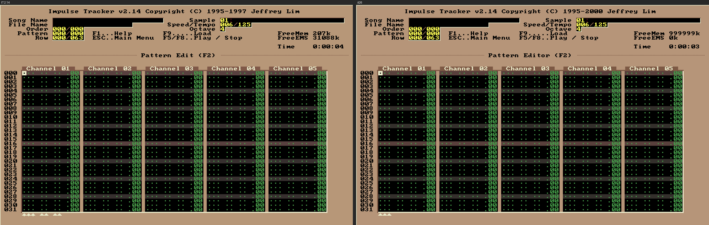

Likely cause: the F9 file screen runs modally and leaves
`Screen == SCR_PATTERN`. The F2 it hands back through `PendingGlobalKey`
(`it_editor.c:10241`, dispatched in the main loop at `:16720`) then reaches
`Glbl_F2` (`:12679`), which sees "already in the pattern editor" and opens
the options. In IT, F9 makes the load screen the current screen, so Glbl_F2
switches back.

Script: `tests/f2_after_f9.hds`

Issue: #29

<!-- crit:F1 -->
**Crit:** 
<!-- /crit:F1 -->

## F2 — Load Module file list: separator column missing, titles shifted

IT draws a vertical divider (glyph `A8h`, shown as `¿` in the text dumps)
at column 14 on **every** row of the list, including empty rows, and starts
the song title right after it (col 15). it26 has no divider, starts the
title two columns later (col 17), and the highlight bar runs across the
whole list width.

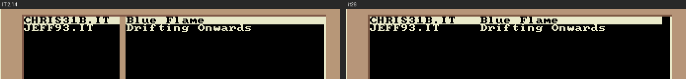

Cells: rows 13–44, cols 2–41 (`out/it_screens/report.md#01_load_module`).

Issue: #30

<!-- crit:F2 -->
**Crit:** 
<!-- /crit:F2 -->

## F3 — Load Module file info box

For CHRIS31B.IT:

| field | IT 2.14 | it26 |
|---|---|---|
| Format | `Compressed Impulse Tracker` | ` Impulse Tracker` (leading space, no "Compressed") |
| Size | `000349888` left-aligned | `       000349888` (padded right) |
| Date | `October 10, 2026` | empty |
| Time | `8:43pm` | empty |

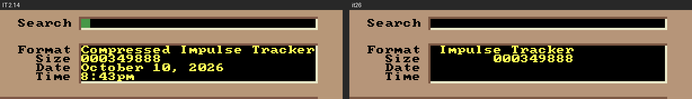

Issue: #31

<!-- crit:F3 -->
**Crit:** 
<!-- /crit:F3 -->

## F4 — Filename mask

IT 2.14: `*.IT, *.XM, *.S3M, *.MTM, *.669, *.MOD`. it26: `*.IT`. Row 46.


Issue: #32

<!-- crit:F4 -->
**Crit:** 
<!-- /crit:F4 -->

## F5 — Section title centering

The title in the row-11 bar is one column further left on it26 for
odd-length titles: Sample List (F3), Load Module (F9), Instrument List
(F4), Order List and Panning (F11), Help, and Song Variables (F12). This
looks like a rounding difference in the centering. Check the title-drawing
routine in the ASM before changing it. Separately, IT 2.14 says
**"Pattern Edit (F2)"** and it26 **"Pattern Editor (F2)"**. The 2.17 source
has "Pattern Editor (F2)" (`IT_OBJ1.ASM:2478`), so the wording is correct
and only the centering is a finding.

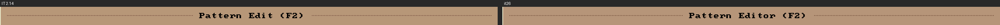
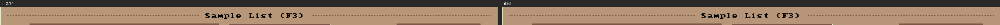

Issue: #33

<!-- crit:F5 -->
**Crit:** 
<!-- /crit:F5 -->

## F6 — Copyright line

`Impulse Tracker v2.14 Copyright (C) 1995-1997` vs `... 1995-2000`. The
2.17 source has "1995-2000" (`IT_F.ASM:470`), so this is a version
difference, not a port bug. Listed so it isn't filed.


<!-- crit:F6 -->
**Crit:** 
<!-- /crit:F6 -->

## F7 — Pattern editor: markers under channel 1

Below the pattern (row 47), IT shows three groups of markers under the
first channel's note, instrument and volume columns (`▲▲▲ ▲▲ ▲▲`). it26
shows only the first group. Same on an empty song and with JEFF93.IT
loaded.

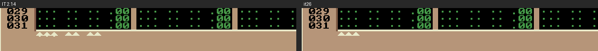

Issue: #34

<!-- crit:F7 -->
**Crit:** 
<!-- /crit:F7 -->

## F8 — F3 sample info panel colours

Colour-only differences (same characters) in the Filename, Loop and SusLoop
fields of the right-hand panel (rows 13, 15, 18, cols 60–75). They're subtle
in the screenshot; the per-cell attributes are in the report.

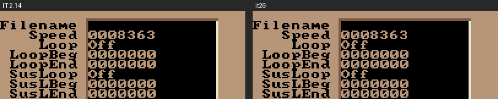

Issue: #35

<!-- crit:F8 -->
**Crit:** 
<!-- /crit:F8 -->

## F9 — F3 header label with an instrument-mode song

JEFF93.IT loaded, then F3. IT 2.14's header shows **`Sample 01:Strings`**
(the sample list switches the header to the sample). it26 keeps
**`Instrument 01:High Strings 1`**.


Issue: #36

<!-- crit:F9 -->
**Crit:** 
<!-- /crit:F9 -->

## F10 — F4 colours

Colour-only differences on the Instrument List: row 16 (the note/sample
cells of instrument 04) and the Filename field at row 47.

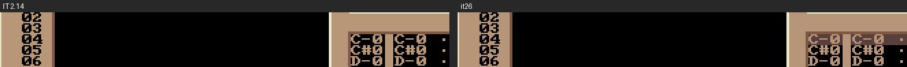
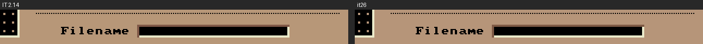

Issue: #37

<!-- crit:F10 -->
**Crit:** 
<!-- /crit:F10 -->

## F11 — F11 order list

On an empty song:

- it26 draws the order numbers one column further left (`000 Æ` vs ` 000Æ`).
- Order 000 shows **`000`** on it26 and **`---`** on IT 2.14. A new song
  has no orders yet.

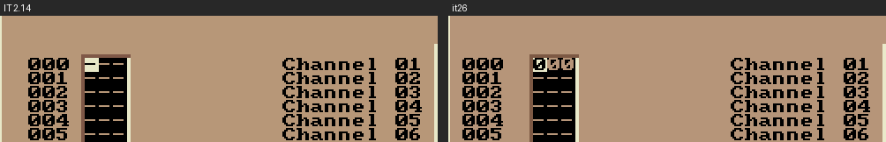

Issue: #38

<!-- crit:F11 -->
**Crit:** 
<!-- /crit:F11 -->

## F12 — F12 Song Name field colour

Colour-only, row 16 cols 16–39.

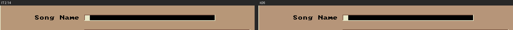

Issue: #39

<!-- crit:F12 -->
**Crit:** 
<!-- /crit:F12 -->

## F13 — Help: Ctrl-D

it26 leaves out "Ctrl-D DOS Shell", so every line after it moves up by
one. Intentional (commit 9c8bbf6 "Ctrl-D hidden"); listed only so it isn't
filed again.

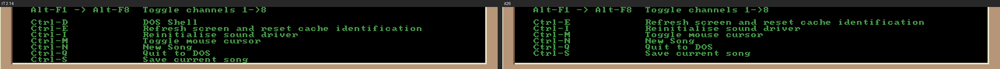

<!-- crit:F13 -->
**Crit:** 
<!-- /crit:F13 -->

## F14 — No load-progress screen; different screen after loading

Confirmed in DOSBox 0.74-3 (2026-10-10) and under QEMU.

**While loading** (F9 → select → Enter), IT 2.14 replaces the file list
with a progress log under the "Load Module (F9)" title. It has an
underlined format line ("Impulse Tracker Module"), then `File Header`,
`Instrument n`, `Sample Header n`, `Sample n` and `Pattern n` lines in
yellow, each counting up as it goes. Source: `D_LoadIT`
(`IT_D_RM.INC:2360`), messages at `IT_DISK.ASM:397-401` (`HeaderMsg`,
`SampleMsg`, `SHLoadMsg`, `InstrumentMsg`, `PatternMsg`). it26 has the
**save** counterpart (`save_progress_draw`, `it_editor.c:9906`) but no
load progress at all.

DOSBox (slow enough to see every stage):

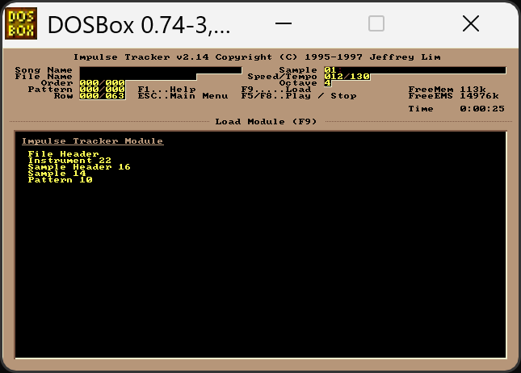

QEMU, 30 ms after Enter:

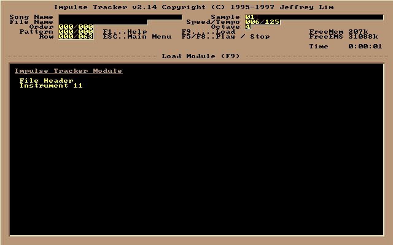

**After loading**, IT 2.14 stays on a screen with the header and an
**empty body with an empty title bar** (still the same 6 s later) until the
next key; F2 then opens the pattern editor normally. it26 goes straight to
the pattern editor.

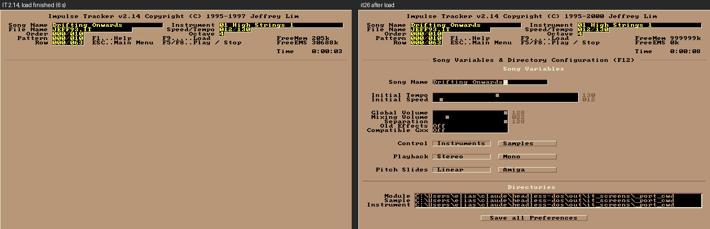

Capturing the progress window in a script needs the polling approach, not
`stable` (QEMU loads JEFF93.IT in well under 100 ms).

Issue: #40

<!-- crit:F14 -->
**Crit:** 
<!-- /crit:F14 -->
