# it26 vs IT 2.14: second comparison round (modals, song variables, more screens)

Run: 2026-10-11. IT 2.14 (`IT /S0`) under QEMU + FreeDOS vs it26 master
`2593f41` (plus the main menu fix, G1), remote backend. Same setup as the
[first round](../2026-10-10/FINDINGS.md). Left image = IT 2.14, right = it26.

New scripts:

| Script | Covers |
|---|---|
| `tests/compare/modals.hds` | main menu and its submenus, Ctrl-Q, Ctrl-N, Pattern Editor Options (empty song) |
| `tests/compare/modals2.hds` | F3 Alt-D/X/S/F/M/R/Y, F4 Alt-D/P/S, pattern editor Ctrl-F2, Alt-J, Ctrl-Backspace, Alt-N (JEFF93.IT) |
| `tests/compare/song_vars.hds` | F12 Song Variables, focus walked with Down and Tab, empty song and JEFF93.IT |
| `tests/compare/screens2.hds` | F11 twice, Shift-F9, Ctrl-F1, Ctrl-F12, F10, Ctrl-F3, Ctrl-F4, Load Instrument (JEFF93.IT) |

```
python tools/compare/compare.py compare-run --script tests/compare/modals.hds --out build-compare/r2/modals
```

## Matches

These match IT 2.14 apart from the known rows (copyright year, FreeMem,
clock, 2.17 wording, host paths):

- Ctrl-Q "Exit Impulse Tracker?", the File / Playback / Sample /
  Instrument menus (after G1), Pattern Editor Options.
- F3: Delete sample (but see G7), Calculate C-5 frequency (Alt-Y).
- F4: Delete instrument, Copy instrument, Swap instruments.
- Pattern editor: Set pattern length (Ctrl-F2).
- F11 (first press), message editor (Shift-F9).
- F12 Song Variables on an empty song and with JEFF93.IT, walking the
  focus down through every object (only G11 and G12 differ).
- Load Instrument, the sample and instrument libraries (host directory
  entries and F15 aside).

## Findings

| # | Finding | Kind | Status |
|---|---|---|---|
| G1 | Main menu opens on "View Patterns" instead of "File Menu..."; submenus forget their position | behaviour | **fixed locally** (067eebe) |
| G2 | Parent menu item drawn highlighted while its submenu is open | colour (visible) | open |
| G3 | Ctrl-N clears the song at once; IT asks with the New Song dialog (Keep/Clear per part, OK/Cancel) | behaviour, **data loss** | open |
| G4 | F11 on the order list: the Channel Volume page is missing | missing screen | open |
| G5 | Ctrl-F12 Palette Configuration is missing | missing screen | open |
| G6 | F3 Alt-X / Alt-S / Alt-R / Alt-F: generic number prompt instead of IT's dialogs | layout | open |
| G7 | F3 "Delete sample?" and "Sample Amplification %" one column off | layout | open |
| G8 | Block commands without a block: status line instead of the "No block is marked" dialog | behaviour | open |
| G9 | Ctrl-Backspace with nothing to undo: no Undo dialog; the dialog's layout differs too | behaviour/layout | open |
| G10 | Alt-N prints "Multichannel enabled/disabled for this channel"; IT toggles silently | text | open (minor) |
| G11 | F12: Tab on "Save all Preferences" wraps to Song Name; IT stays (no Tab link) | navigation | open |
| G12 | F12 / menus: cells after button and menu labels in the wrong colour (spaces) | colour (invisible) | open (minor) |
| G13 | F10 Filename pre-filled with the loaded name; IT clears it (`D_ClearFileSpecifier`) | behaviour | documented port choice (HANDOFF) |
| G14 | Ctrl-F1 shows the port's key-press table, not IT's "Keyboard Information" | screen | documented (HANDOFF: layout not ported) |

Not findings: the F10 "IT215" button (2.17 source, behind `IF DDCOMPRESS`;
IT215 compression came with 2.15), "Pattern Editor Options" vs "Pattern
Edit Options" (2.17 wording), directory entries and drives (environment).

---

## G1 — Main menu starts on the wrong item (fixed locally)

`O1_MainMenu` and the submenus start with `DW 3`, their first item, and
`F_MainMenu` / `F_FileMenu` / ... open them with `CX = 0FFFFh`, i.e. on
the object they were left on (`M_Object1List`, `IT_M.ASM` 638). it26
opened the main menu on "View Patterns", so Esc, Enter left the menu
instead of opening the File menu, and the submenus always started on
their first item. Fixed in 067eebe (local).

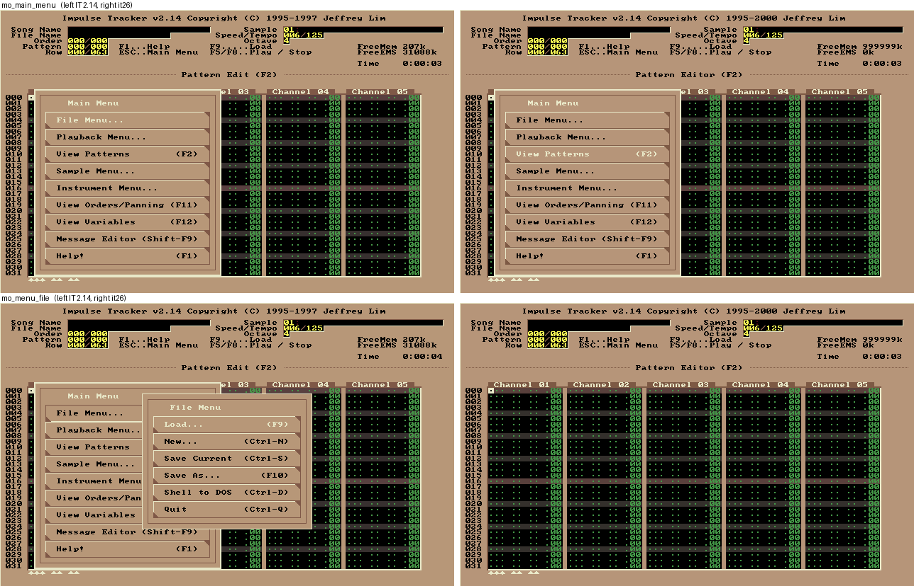

## G2 — Parent menu item highlighted under its submenu

With the File menu open, IT draws "File Menu..." in the main menu as a
normal raised button with black text: only the active object list gets
its focus highlight. it26 keeps it highlighted (pressed bevel, text 23h).

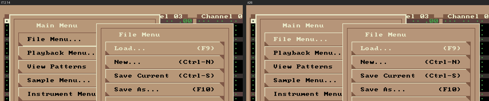

## G3 — Ctrl-N: no New Song dialog

`F_NewSong` (`IT_F.ASM` 4966) runs `O1_NewSongList` (`IT_OBJ1.ASM` 6616):
Keep/Clear for Patterns, Samples, Instruments and Order List, focus on
OK, and only clears what was chosen. it26's Ctrl-N (and File > New...)
calls `new_song()` directly: everything is cleared without asking.

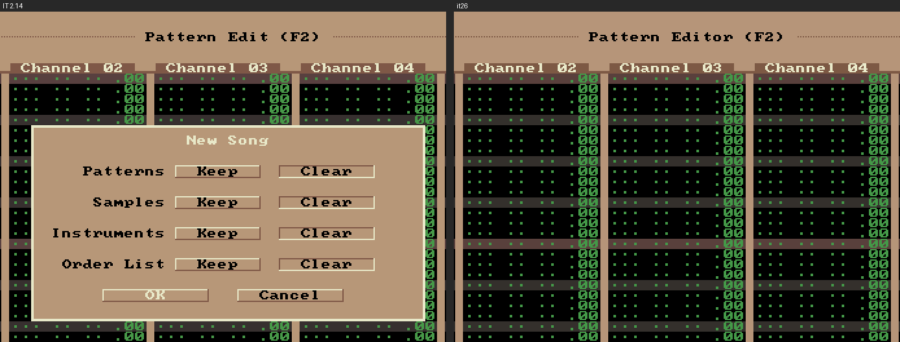

## G4 — F11 Channel Volume page missing

`Glbl_F11` (`IT_G.ASM` 528): F11 on the order list (mode 11) switches to
`O1_OrderVolumeList`, "Order List and Channel Volume" (mode 21). it26
stays on the panning page; channel volumes (`ChnlVol`) can't be edited
anywhere.

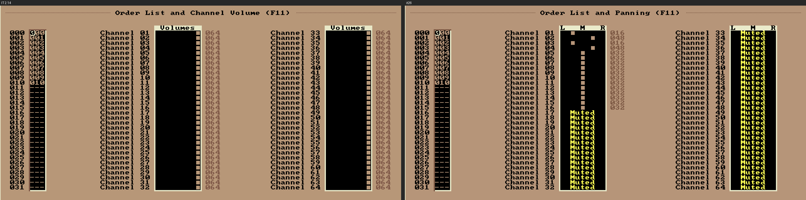

## G5 — Ctrl-F12 Palette Configuration missing

`Glbl_Ctrl_F12` (`IT_G.ASM` 630) opens `O1_ConfigurePaletteList`: the
colours with RGB sliders and the predefined palettes. it26 has no Ctrl-F12 key code
(the harness sends F12 instead, hence Song Variables on the right) and a
fixed palette.

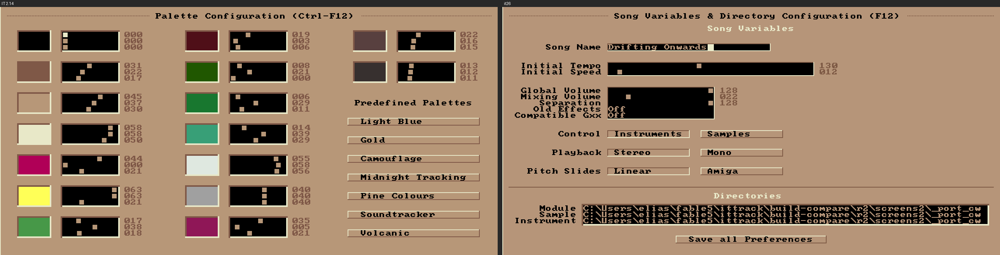

## G6 — F3 dialogs: Exchange, Swap, Replace, Resize

IT has proper dialogs: "Exchange sample with:" / "Swap sample with:" /
"Replace sample with:" with a "Sample" number field and a Cancel button,
and "Resize Sample" with "New Length" (`O1_ExchangeSampleList`,
`O1_SwapSampleList`, `O1_ReplaceSampleList`, `O1_ResizeSampleList`).
it26 shows a one-line prompt ("Exchange current sample with", "Replace
all uses of current with", "Resize sample to (no interpolation)") with an input field, in a different box.

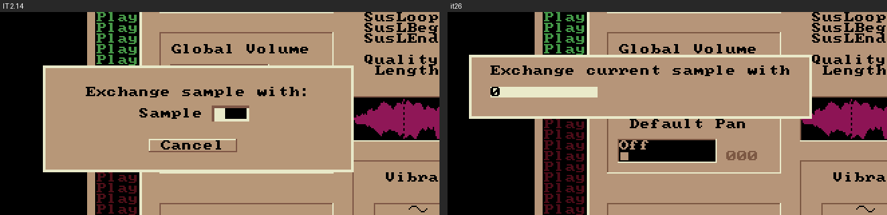
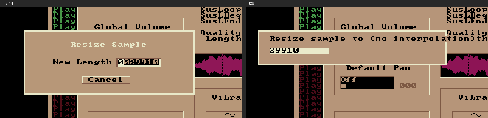

## G7 — F3 dialog texts one column off

"Delete sample?" starts at column 34 in IT, 33 in it26; "Sample
Amplification %" at 29 in IT, 30 in it26 (row 27).

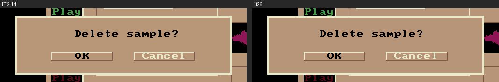

## G8 — "No block is marked" is a dialog in IT

`PEFunction_NoBlockMarkedMessage` (`IT_PE.ASM` 6663) opens
`O1_NoBlockMarkedList`: "No block is marked" with an OK button. it26
prints "No block is marked." in the status line (seen with Alt-J).

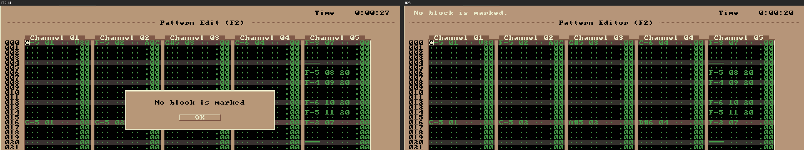

## G9 — Undo dialog

Ctrl-Backspace with an empty undo buffer: IT opens the "Undo" dialog
with ten "Empty" entries (`O1_UndoList`); it26 prints "Nothing to undo."
and shows nothing. it26's dialog, when there is something to undo, has
an "Undo:" label instead of IT's title and list box. (Right image: a
port-only run, as the port side of `modals2` had the main menu open at
that point.)

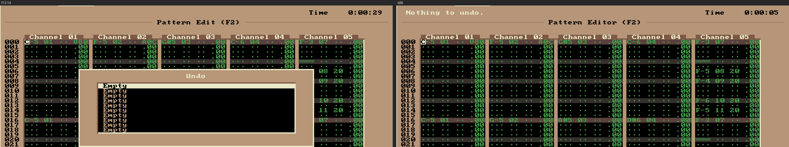

## G10 — Alt-N status text

`PEFunction_ToggleMultiChannel` toggles silently; a second Alt-N in a
row opens "Multichannel Selection" (the port has that dialog). it26 also
prints "Multichannel enabled/disabled for this channel", which is not in
the source.

## G11 — F12 Tab order

IT's objects carry explicit Up/Down/Tab links. `SaveDirectoryConfigButton`
(`IT_OBJ1.ASM` 5560) has none for Tab (`0FFFFh`), so Tab stays on "Save
all Preferences". it26's generic widget navigation wraps to Song Name.
Other screens may differ in the same way; only F12 was checked.

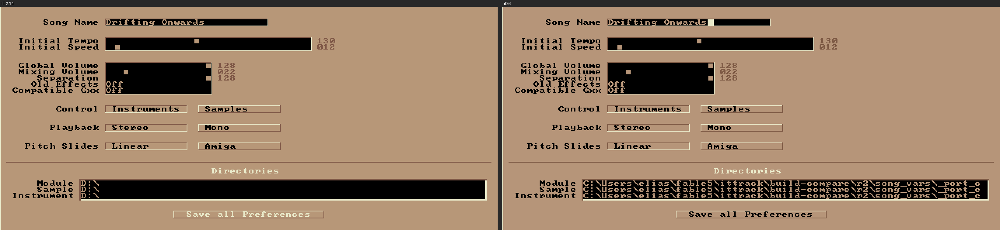

## G12 — Colours of blank cells (invisible)

After the focus has passed the F12 radio buttons, the cells after
"Stereo", "Linear", "Instruments" are 20h in IT and 23h in it26; in the
menus, the cell after "(F9)" / "(Ctrl-N)" and the end of the previously
selected main menu item likewise. All spaces on the same background, so
nothing shows on screen.

## G13 — F10 Filename

`Glbl_F10` calls `D_ClearFileSpecifier`: the Filename field starts
empty. it26 fills in the loaded file name (or `UNTITLED.IT`), as
described in HANDOFF ("editable filename primed from the loaded name").
A convenience; keep or drop.

## G14 — Ctrl-F1

IT 2.14 shows "Keyboard Information" (keyboard queue, keypress table,
Clear Keyboard Tables). it26 binds Ctrl-F1 to its own key-press table
(feature 014); HANDOFF already says the layout is not ported.
